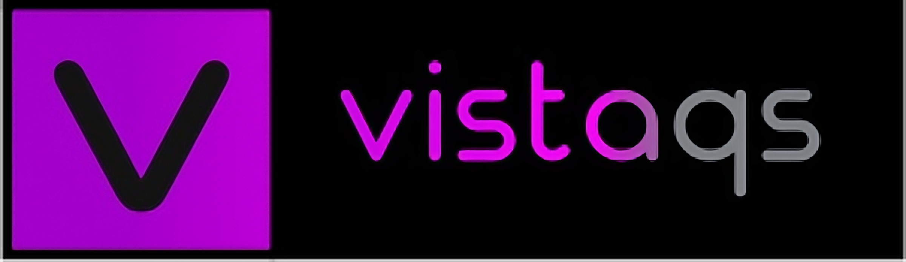
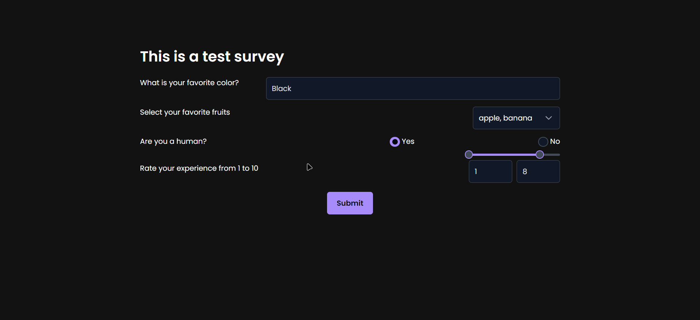
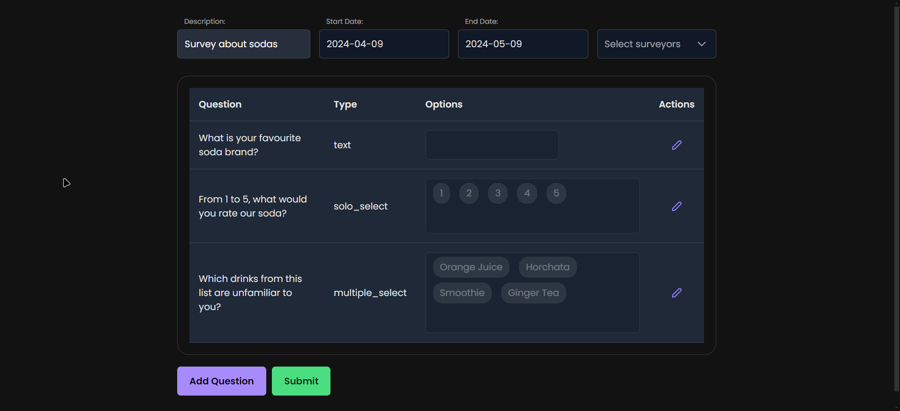
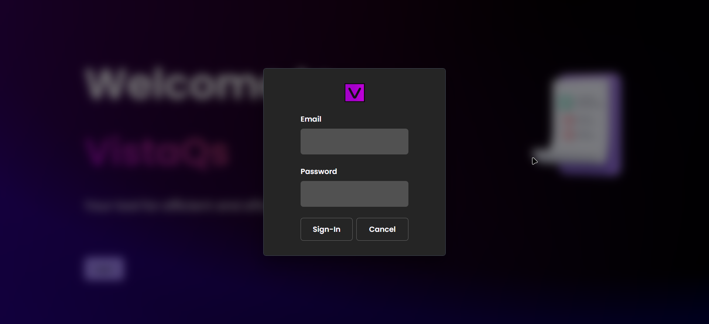
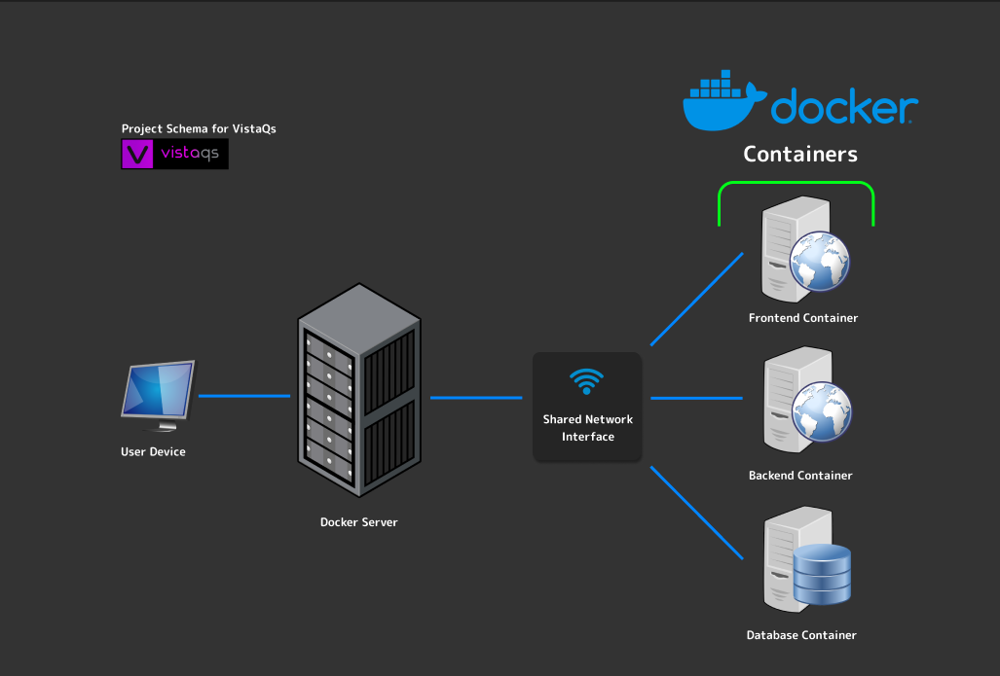

# 📊 VistaQs

VistaQs is a survey web application developed as a school project for Ins Rafael Campalans. The application is designed to facilitate the collection of street survey data.
<div align="center">

</div>

## 🎯 Project Objective

```markdown
Proposed exercise:
"We envision ourselves as a company dedicated to capturing data from street surveys. We have a team of individuals stationed at various locations, using tablets or smartphones to ask passersby a series of questions. These responses are then sent to a central server where the information is stored.

The survey consists of questions designed to gauge whether the respondent might be interested in a product we plan to market in the near future. The questions can be answered in various ways - a simple yes/no, a short answer, a rating, etc.

Our goal is to create the infrastructure and client/server developments to support our company's survey capture needs. Additionally, we aim to effectively manage the project, the code, and the generated documentation."
```
---

## 📸 Preview

<div align="center">
    
    
    
    
    
    
</div>

https://github.com/oriolmontcreus/vistaQS/assets/58004352/5539e2fc-df9c-4027-b01c-63958a7366a9

---

## 🛠️ Tech Stack

VistaQs utilizes the following stack:

| Area     | Technology           |
|----------|----------------------|
| Frontend | Angular 17.2         |
| Backend  | PHP 8.2.12           |
|          | Laravel 10.43.0      |
| Database | PostgreSQL           |

Deployment of the application is managed using Docker. The application is divided into three separate containers:

1. **Frontend Container**: Houses the Angular application.
2. **Backend Container**: Contains the PHP and Laravel backend.
3. **Database Container**: Manages the PostgreSQL database.

Each container has its own Dockerfile, and a main Docker Compose file is used to orchestrate the building and running of these containers.

<div align="center">

</div>

---

## 🚀 Usage (Local)

### Prerequisites

You will need the following installed on your system:

1. **Git**: Git is used for version control in this project. If it's not installed on your system, you can download it from [https://git-scm.com/](https://git-scm.com/).

2. **Node.js and npm**: These are required for the frontend of the project. You can download and install them from [https://nodejs.org/](https://nodejs.org/).

3. **Angular CLI**: This is used to serve the frontend of the project. You can install it globally on your system with `npm install -g @angular/cli`.

4. **PHP 8.2.12**: This is required for the backend of the project. You can download and install it from [https://www.php.net/](https://www.php.net/).

5. **Laravel 10.43.0**: This is the framework used for the backend of the project. You can install it with `composer global require laravel/installer`.

6. **PostgreSQL**: This is the database used in the project. You can download and install it from [https://www.postgresql.org/](https://www.postgresql.org/).

### Installation and Running the Project

1. Install PHP 8.2.12 on your system. You can download it from [https://www.php.net/](https://www.php.net/).

2. Install Laravel 10.43.0 on your system. You can do this with `composer global require laravel/installer`.

3. Install PostgreSQL on your system. You can download it from [https://www.postgresql.org/](https://www.postgresql.org/). After installation, ensure that the PostgreSQL service is running.

4. Clone this repository to your local system using `git clone https://github.com/oriolmontcreus/vistaQS.git`.

5. Navigate to the Backend directory using `cd Backend`.

6. Install the backend dependencies with `composer install`.

7. Start the backend service with `php artisan serve`.

8. Open another terminal and navigate to the Frontend directory using `cd ../Frontend`.

9. Install the frontend dependencies with `npm ci`.

10. To run the frontend on your local system, execute `ng serve --open --port 4201` in the command line. This will automatically open your browser with the webpage.

### Automation

The deployment process is automated using a `deploy.sh` script. This script also calls `deploy_backend.sh` and `start.sh` to streamline the deployment process.
